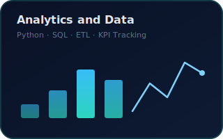
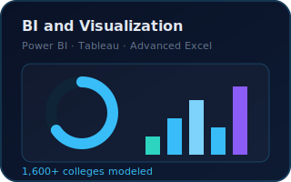
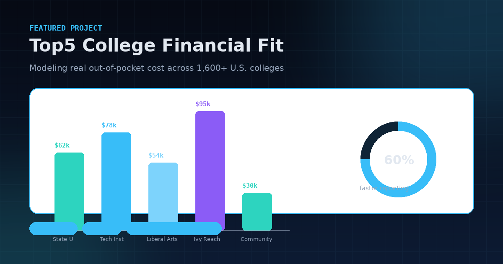
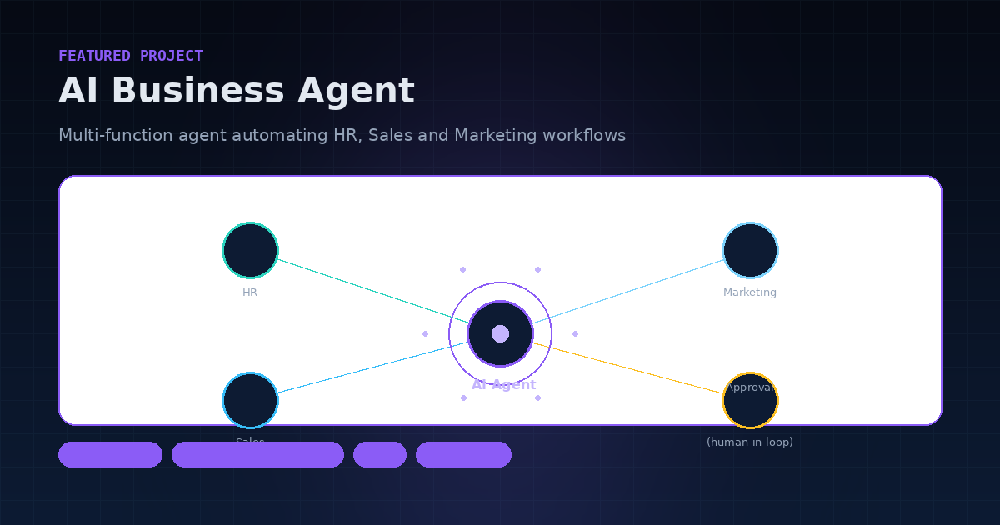
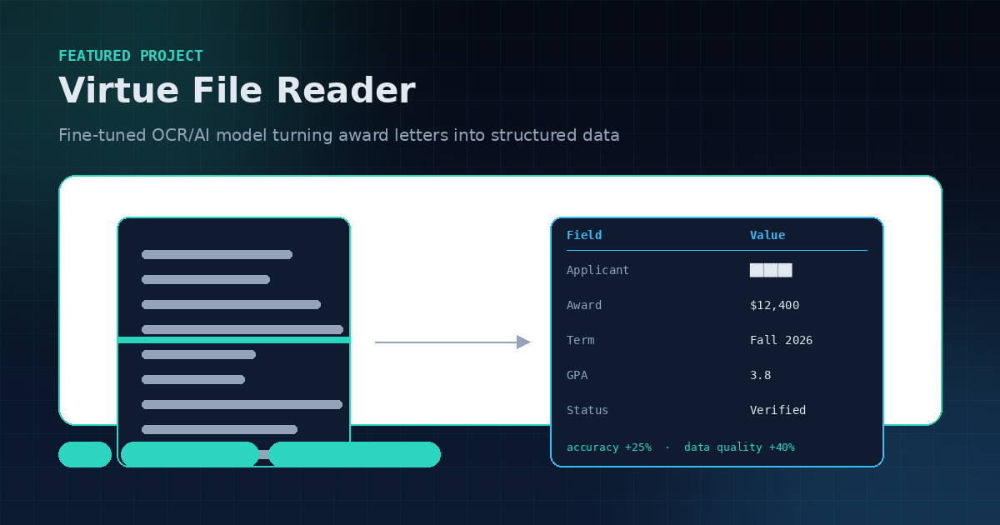
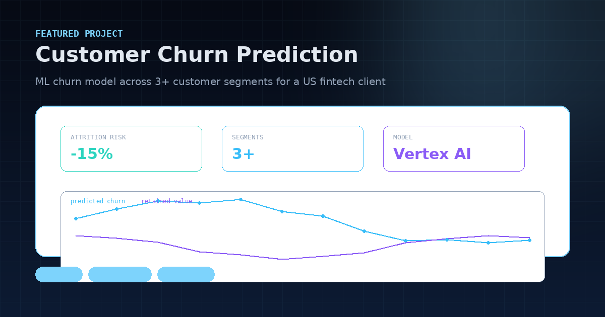

<div align="center">



<a href="https://github.com/Hemant6557">
  
</a>

<br/>


<br/><br/>


</div>

<br/>

## About Me

 **Business and Data Analyst with 4+ years of experience turning complex, multi-source data into measurable outcomes across EdTech and FinTech.** I've shipped Power BI dashboards, ETL pipelines, predictive models, and AI-powered automation tools end-to-end — from requirements gathering through production — and I'm now focused on pushing further into AI automation and agentic systems.

<table>
<tr>
<td width="50%" valign="top">/>

**What I bring to a team**
- 🎯 4+ years translating messy, multi-source data into decisions leadership actually acts on
- 📊 End-to-end BI delivery: requirements → data model → dashboard → adoption
- 🤖 Hands-on production experience building AI agents and OCR pipelines, not just prototypes
- 🤝 Strong stakeholder management, BRD/FRD authorship, and Agile/Scrum delivery
- 🧭 Comfortable owning ambiguity — I've advised non-technical founders as well as enterprise clients

</td>
<td width="50%" valign="top">

**Currently**
- 💼 Data and Business Analyst @ **Virtue Analytics**
- 🧠 Deepening skills in LangChain, agentic workflows, and applied Gen AI
- 📈 Shipping ML churn models on Vertex AI and BigQuery for a US fintech client
- 🎓 B.Tech, Mechanical Engineering — Krishna Institute of Engineering and Technology
- 📍 Lucknow, India — open to remote and hybrid roles

</td>
</tr>
</table>

<br/>

## Professional Timeline



<br/>

## Experience

<details open>
<summary><b>Data and Business Analyst · Virtue Analytics</b> &nbsp;|&nbsp; Feb 2025 – Present &nbsp;|&nbsp; Lucknow, India</summary>
<br/>

| Initiative | Impact |
|---|---|
| **Top5 Colleges Financial Fit Platform** | Modeled out-of-pocket cost estimates across 1,600+ colleges; deployed Power BI dashboards for scholarship comparisons, accelerating management reporting by **60%** |
| **Customer Churn Model (US Client)** | Built an ML churn prediction model across 3+ customer segments using Python, Vertex AI, and BigQuery, projected to reduce attrition by **15%+** |
| **AI Business Agent** | Architected a multi-function AI agent automating HR, Sales, and Marketing workflows using Python, LangChain, Claude/OpenAI API, n8n, and Supabase, with a human-in-the-loop approval layer |
| **Virtue File Reader (VFR)** | Fine-tuned an OCR/AI model to parse award letters and transcripts into structured data, boosting parsing accuracy by **25%** and overall data quality by **40%** |

</details>

<details>
<summary><b>Data Analyst · Beyond Algo</b> &nbsp;|&nbsp; Jun 2023 – Feb 2025 &nbsp;|&nbsp; Lucknow, India</summary>
<br/>

- Automated reporting workflows with Excel and Power Query, reducing manual processing time by **35%**
- Built KPI performance trackers using XLOOKUP, INDEX-MATCH, and PivotTables for real-time business visibility
- Audited and reconciled multi-source datasets end-to-end, closing process gaps and strengthening data integrity

</details>

<details>
<summary><b>Data Consultant · House of Tantu</b> &nbsp;|&nbsp; Nov 2021 – May 2023 &nbsp;|&nbsp; Delhi, India</summary>
<br/>

- Analyzed customer, product, and pricing data to shape merchandising and e-commerce growth strategy
- Built Excel sales trackers and advised non-technical owners, enabling data-led decisions that lifted business performance

</details>

<br/>

## Tech Stack

**Languages**


**BI and Visualization**


**Cloud and Data**


**AI and Automation**


**Dev Tools**


<br/>

## Skill Cards

<div align="center">



</div>

<br/>

## Featured Projects

### 📊 Top5 — College Financial Fit Platform



Models out-of-pocket cost estimates across 1,600+ colleges with Power BI dashboards for scholarship comparisons, accelerating management reporting by 60%.

| Layer | Technology |
|---|---|
| Analytics | Python, Predictive Modeling |
| BI / Visualization | Power BI |
| Data | Multi-Source Integration, ETL |

<a href="https://github.com/Hemant6557/Top5">
  
</a>

🔗 **Source Code:** [github.com/Hemant6557/Top5](https://github.com/Hemant6557/Top5)

---

### 🤖 AI Business Agent



Multi-function AI agent automating HR, Sales, and Marketing workflows, eliminating manual task-triggering with a human-in-the-loop approval layer.

| Layer | Technology |
|---|---|
| Orchestration | LangChain, Python |
| Models | Claude API, OpenAI API |
| Automation | n8n, Supabase |

🔒 **Proprietary client project** — built for Virtue Analytics; source not publicly available.

---

### 🗂️ Virtue File Reader (VFR)



Fine-tuned OCR/AI model that parses award letters and transcripts into structured data, boosting parsing accuracy by 25% and overall data quality by 40%.

| Layer | Technology |
|---|---|
| Extraction | OCR, Generative AI |
| Tuning | Model Fine-Tuning |
| Storage | Supabase |

🔒 **Proprietary client project** — built for Virtue Analytics; source not publicly available.

---

### 📉 Customer Churn Prediction



ML churn prediction model across 3+ customer segments for a US client, projected to reduce attrition by 15%+.

| Layer | Technology |
|---|---|
| Modeling | Python, Regression |
| Platform | Vertex AI, BigQuery |
| Reporting | Power BI |

🔒 **Proprietary client project** — built for Virtue Analytics; source not publicly available.

---

### 🔍 Screening Project

<a href="https://github.com/Hemant6557/screening-project">
  
</a>

A data screening and automation project built to streamline data-driven decision workflows.

🔗 **Source Code:** [github.com/Hemant6557/screening-project](https://github.com/Hemant6557/screening-project)

<br/>

## GitHub Stats

<div align="center">


</div>

<br/>

## Contribution Activity

<div align="center">

</div>

<br/>

## Trophies

<div align="center">

</div>

<br/>

## Contribution Snake

<div align="center">

<picture>
  <source media="(prefers-color-scheme: dark)" srcset="https://raw.githubusercontent.com/Hemant6557/Hemant6557/output/github-contribution-grid-snake-dark.svg" />
  <source media="(prefers-color-scheme: light)" srcset="https://raw.githubusercontent.com/Hemant6557/Hemant6557/output/github-contribution-grid-snake.svg" />
  
</picture>

<sub>Generated automatically by <a href=".github/workflows/snake.yml">.github/workflows/snake.yml</a> — appears after the workflow's first run.</sub>

</div>

<br/>

## Certifications

<div align="center">


<br/>


</div>

<br/>

## Current Focus

```text
> status.now()

  role        : Data and Business Analyst @ Virtue Analytics
  building    : AI Business Agent v2 -- expanding human-in-the-loop controls
  learning    : agentic RAG patterns, LangChain evaluation tooling
  goal        : Data/BI Analyst -> AI Automation Engineer
  open_to     : Data Analyst, Business Analyst, BI Developer, AI Automation roles
```

<br/>

## Contact

<div align="center">

<a href="https://www.linkedin.com/in/hemantkumar6557/">
  
</a>
<a href="mailto:Hemant6557@gmail.com">
  
</a>

</div>


